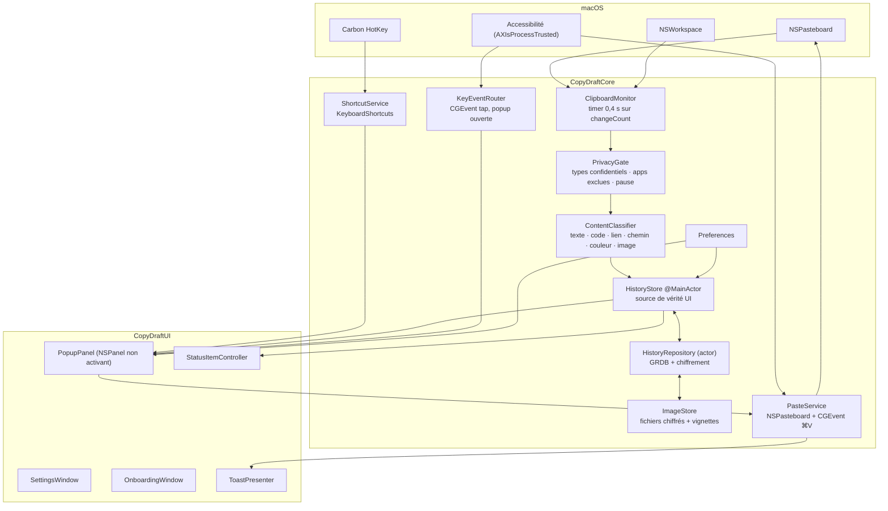
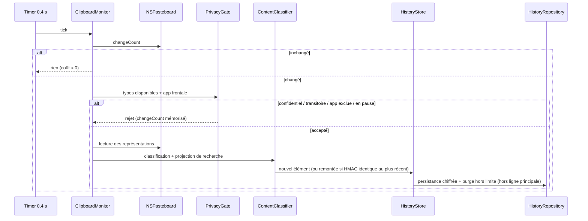
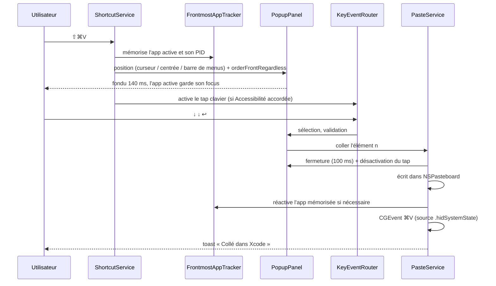

# Architecture technique — CopyDraft

## 1. Vue d'ensemble

CopyDraft est une application macOS mono-processus, sans réseau, structurée en trois couches :

- **Cœur (`CopyDraftCore`)** — logique pure et testable : capture, classification, filtres de
  confidentialité, historique, persistance chiffrée, collage, réglages. Aucune dépendance à
  SwiftUI.
- **Interface (`CopyDraftUI`)** — surfaces SwiftUI et fenêtres AppKit, construites exclusivement
  sur les tokens et composants du design system.
- **Application (`CopyDraft`)** — assemblage, cycle de vie, injection des services.



---

## 2. Structure du projet

Paquet Swift unique (`swift-tools-version: 6.2`, mode langage Swift 6, concurrence stricte).

> **Chaîne de compilation** — le SwiftPM livré avec les seuls Command Line Tools est
> inutilisable sur cette machine : `PackageDescription.swiftinterface` et
> `libPackageDescription.dylib` sont désynchronisés (`swiftLanguageVersions: [SwiftVersion]`
> contre `[SwiftLanguageMode]`), et *aucun* manifeste ne se charge. Le build passe donc par la
> toolchain d'Xcode, sélectionnée par la variable `DEVELOPER_DIR` — sans `sudo xcode-select`.
> `Scripts/build-app.sh` la détecte automatiquement. Pour les commandes manuelles :
> `export DEVELOPER_DIR=/Volumes/Apps/MACAPPS/Xcode.app/Contents/Developer`.

```
CopyDraft/
├── Package.swift
├── Sources/
│   ├── CopyDraftCore/
│   │   ├── Clipboard/       ClipboardMonitor · PasteboardReader · ContentClassifier · PrivacyGate
│   │   ├── Model/           ClipItem · ClipKind · ClipSubtype · SourceApp · HistorySnapshot
│   │   ├── Store/           HistoryStore · HistoryRepository · Migrations · ImageStore
│   │   ├── Crypto/          KeyStore (Trousseau) · Cipher (AES-GCM) · ContentHasher (HMAC)
│   │   ├── Paste/           PasteService · AccessibilityPermission · FrontmostAppTracker
│   │   ├── Input/           ShortcutService · KeyEventRouter · KeyCommand
│   │   └── Settings/        Preferences · ExcludedApps · Theme
│   ├── CopyDraftUI/
│   │   ├── DesignSystem/    Tokens · Typography · Spacing · Motion · Materials
│   │   ├── Components/      CDButton · CDToggle · CDSearchField · CDBadge · CDShortcutRecorder
│   │   ├── Popup/           PopupPanel · PopupPositioner · PopupView · HistoryCell · FooterBar
│   │   │                    EmptyStateView · NoResultsView · PauseBanner
│   │   ├── MenuBar/         StatusItemController · QuickMenuBuilder
│   │   ├── Settings/        SettingsWindowController · GeneralTab · ShortcutTab · PopupTab
│   │   │                    PrivacyTab · AppearanceTab
│   │   ├── Onboarding/      OnboardingWindowController · PermissionView · ReadyView
│   │   └── Feedback/        ToastPresenter · ItemContextMenu · ClearAllAlert · ItemEditor
│   ├── CopyDraftUI/Resources/  Localizable.strings (fr, en) · Assets
│   └── CopyDraft/           main · AppDelegate · ServiceContainer
├── Tests/
│   ├── CopyDraftCoreTests/
│   └── CopyDraftUITests/
├── Scripts/                 build-app.sh · sign-notarize.sh · make-icon.sh
└── docs/
```

**Dépendances externes** (SPM, MIT) :

| Paquet | Usage | Justification |
|---|---|---|
| `groue/GRDB.swift` | Persistance SQLite | Requêtes typées, migrations explicites, observation, performances |
| `sindresorhus/KeyboardShortcuts` | Raccourci global + enregistreur | Répond directement à FR-28/FR-29 ; s'appuie sur Carbon, ne nécessite pas l'Accessibilité |

Aucune autre dépendance. Le chiffrement utilise CryptoKit (système), l'interface SwiftUI/AppKit.

---

## 3. Modèle de données

### 3.1 Modèle mémoire

```swift
struct ClipItem: Identifiable, Sendable {
    let id: UUID
    let kind: ClipKind          // .text, .rich, .image
    let subtype: ClipSubtype    // .plain, .code, .link, .path, .color, .rich, .image
    let createdAt: Date
    var updatedAt: Date
    var pinned: Bool
    var customName: String?     // FR-52
    let source: SourceApp       // bundleID, nom localisé, icône (résolue à la volée)
    let byteCount: Int
    let pixelSize: CGSize?      // images
    let characterCount: Int?    // texte
    let searchText: String      // projection en clair en mémoire, 2 048 caractères max
    let previewLines: [String]  // 1 à 2 lignes déjà aplaties et prêtes à l'affichage
}
```

Le **contenu complet** (texte intégral, RTF/HTML, données image) n'est jamais conservé en
mémoire : il est relu et déchiffré à la demande, au moment du collage ou de l'édition. Cela
borne l'empreinte mémoire (NFR-2) même avec 500 éléments de 4 Mo.

### 3.2 Schéma SQLite

```sql
CREATE TABLE clip_item (
    id            TEXT PRIMARY KEY,          -- UUID
    kind          TEXT NOT NULL,
    subtype       TEXT NOT NULL,
    created_at    DOUBLE NOT NULL,
    updated_at    DOUBLE NOT NULL,
    pinned        INTEGER NOT NULL DEFAULT 0,
    pin_order     INTEGER,
    byte_count    INTEGER NOT NULL,
    pixel_width   INTEGER,
    pixel_height  INTEGER,
    char_count    INTEGER,
    content_hmac  BLOB NOT NULL,             -- HMAC-SHA256(contenu, clé) — déduplication
    payload       BLOB NOT NULL,             -- AES-GCM : { texte, rtf, html, appId, appName,
                                             --   nom personnalisé, fichier image, projection }
    image_file    TEXT                       -- nom du fichier chiffré, images uniquement
);

CREATE INDEX idx_clip_item_order  ON clip_item(pinned DESC, created_at DESC);
CREATE INDEX idx_clip_item_hmac   ON clip_item(content_hmac);
```

Métadonnées en clair (dates, taille, épinglage) pour trier et purger sans déchiffrer ; tout ce
qui est signifiant — contenu, aperçu, nom de l'application source — est dans `payload` chiffré.

### 3.3 Emplacements sur disque

```
~/Library/Application Support/CopyDraft/      (0700)
├── history.sqlite                            base GRDB
├── Images/<uuid>.enc                         image d'origine chiffrée (AES-GCM)
└── Thumbs/<uuid>.enc                         vignette 56×56 @2× chiffrée
```

Clé de chiffrement : 256 bits, générée au premier lancement, stockée dans le Trousseau
(`kSecAttrAccessibleAfterFirstUnlockThisDeviceOnly`, `kSecAttrSynchronizable = false`). Sa
perte rend l'historique illisible : traité comme une réinitialisation, sans blocage.

---

## 4. Flux principaux

### 4.1 Capture



### 4.2 Ouverture de la popup et collage



**Pré-création** : le panneau, son `NSHostingView` et le moteur de rendu sont instanciés au
lancement puis réutilisés. L'ouverture se réduit à un positionnement, un `orderFrontRegardless`
et un fondu — condition pour tenir les 150 ms de NFR-3.

### 4.3 Deux modes de saisie clavier

Le design system exige un panneau **qui ne prend jamais le focus** tout en recevant les
frappes. C'est possible uniquement via un tap d'événements, qui requiert l'Accessibilité — la
même permission que le collage. D'où deux modes :

| | Mode nominal (Accessibilité accordée) | Mode replié (permission absente) |
|---|---|---|
| Panneau | `.nonactivatingPanel`, jamais clé | `.nonactivatingPanel` rendu clé à l'ouverture |
| Clavier | `CGEvent` tap de session, actif uniquement popup ouverte, événements consommés | Chaîne de responsabilité AppKit standard |
| Focus de l'app active | conservé | temporairement perdu, restitué à la fermeture |
| Collage | `CGEvent ⌘V` dans l'app mémorisée | copie seule + toast « Copié — collez avec ⌘V » |

Le tap est **installé à l'ouverture et retiré à la fermeture** : aucune écoute clavier en
dehors de la popup. Ce point est vérifié par test et documenté dans le README (argument de
confiance).

---

## 5. Concurrence et cycle de vie

| Composant | Isolation | Notes |
|---|---|---|
| `ClipboardMonitor` | `@MainActor` | `NSPasteboard` et `NSWorkspace` sont lus sur le fil principal ; le tick est un simple `Int` comparé, coût négligeable |
| `HistoryStore` | `@MainActor`, `@Observable` | Source de vérité de l'interface, mutations synchrones, rendu SwiftUI direct |
| `HistoryStack` | `@MainActor` | Montage de la persistance avec des erreurs nommées (`directories`, `encryptionKey`, `database`), journalisées dans la Console |
| `HistoryRepository` | `actor` | GRDB `DatabaseQueue`, écritures transactionnelles, purge, chiffrement |
| `ImageStore` | `actor` | Écriture/lecture de fichiers, génération de vignettes |
| `PasteService` | `@MainActor` | Ordonnancement fenêtre → focus → `CGEvent` |

Swift 6, concurrence stricte activée (`swiftLanguageMode: .v6`), types du modèle `Sendable`.

**Cycle de vie** — `NSApplication` en agent (`LSUIElement = true`) :
lancement → chargement des réglages → ouverture de la base → restauration de l'historique →
installation de l'icône de barre de menus → enregistrement du raccourci → onboarding si la
permission manque → démarrage du moniteur.
Veille/verrouillage (`NSWorkspace.willSleepNotification`, `screensDidSleep`, session inactive) →
suspension du timer ; réveil → resynchronisation du `changeCount` sans capture rétroactive.
Extinction → purge de l'historique non épinglé si le réglage l'exige, fermeture propre de la base.

---

## 6. Interface et design system

- `Sources/CopyDraftUI/DesignSystem/Tokens.swift` est la transcription **littérale** de
  `design-system §1.6` (`CD.Color`, `CD.Radius`, `CD.Space`, `CD.Metric`, `CD.Font`), complétée
  par `CD.Motion` (durées et courbe du §10) et `CD.Material`.
- Les rôles de couleur sont adossés aux couleurs système (`controlAccentColor`,
  `selectedContentBackgroundColor`, `separatorColor`, `quaternarySystemFill`) : le thème clair /
  sombre et l'accent choisi par l'utilisateur suivent automatiquement.
- Matériau de la popup : `NSVisualEffectView` en `.hudWindow` / `.behindWindow`, avec repli
  opaque `--bg-popover-solid` si « Réduire la transparence » est actif.
- Aucun composant n'est créé hors de `Components/` ; tout besoin non couvert par le design
  system est signalé avant implémentation (§11.3 du cahier des charges).
- Mouvement : une seule courbe `cubic-bezier(.2,.8,.3,1)`, durées du tableau §10, toutes
  ramenées à 0 ms (sauf fondus à 80 ms) si « Réduire les animations » est actif.

---

## 7. Sécurité et vie privée

| Menace | Parade |
|---|---|
| Capture d'un mot de passe | `PrivacyGate` rejette `ConcealedType`, `TransientType`, `AutoGeneratedType`, `com.agilebits.onepassword` — non désactivable (FR-9) |
| Capture depuis une app sensible | Liste d'exclusion par identifiant de bundle, évaluée avant toute lecture du contenu |
| Lecture du disque par un tiers | Contenus chiffrés AES-GCM, clé dans le Trousseau, dossier en `0700` |
| Écoute clavier permanente | Tap installé uniquement pendant l'ouverture de la popup, retiré à la fermeture, jamais en mode « écoute seule globale » |
| Exfiltration | Aucune API réseau liée, aucune dépendance réseau ; vérifié par revue et par test d'absence de connexion |
| Résidu après suppression | Suppression d'un élément = suppression de la ligne **et** des fichiers image/vignette associés, dans la même opération |

Durcissement au build : *hardened runtime*, pas d'entitlement autre que ceux exigés par
l'Accessibilité, pas de sandbox (décision §12.1), signature Developer ID, notarisation.

---

## 8. Décisions d'architecture (ADR)

| # | Décision | Alternatives écartées | Motif |
|---|---|---|---|
| ADR-1 | Paquet Swift (SPM) compilable sans Xcode, `.app` assemblée par script | `.xcodeproj` versionné ; XcodeGen ; Tuist | Xcode n'est pas installé sur la machine de développement ; le SDK, `notarytool` et `stapler` des Command Line Tools suffisent. Projet lisible et diffable, aucune génération à maintenir |
| ADR-2 | Chiffrement **au niveau du champ** (AES-GCM/CryptoKit) plutôt que base chiffrée (SQLCipher) | SQLCipher via GRDB | Aucune dépendance native supplémentaire, aucun build custom de SQLite. Conséquence assumée : pas de recherche SQL sur le contenu — la recherche se fait en mémoire (ADR-3) |
| ADR-3 | Recherche **en mémoire** sur une projection de 2 048 caractères par élément | FTS5 SQLite | 500 éléments maximum : un filtrage linéaire sur des chaînes normalisées tient largement sous 16 ms. Limite assumée et documentée : la recherche ne porte pas au-delà de 2 048 caractères |
| ADR-4 | Contenu complet relu à la demande, jamais en mémoire | Cache mémoire complet | Borne l'empreinte à quelques Mo quelle que soit la taille de l'historique (NFR-2) |
| ADR-5 | `NSStatusItem` (AppKit) plutôt que `MenuBarExtra` | `MenuBarExtra` SwiftUI | Le design system exige un menu système strict, le `⌥`-clic ouvrant la popup, et une icône *template* à deux états : contrôle non offert par `MenuBarExtra` |
| ADR-6 | Clavier par tap `CGEvent` pendant l'ouverture de la popup, avec mode replié | Panneau activant systématique | Seul moyen de tenir la promesse « ne prend jamais le focus » du design system ; la permission est de toute façon requise pour le collage |
| ADR-7 | `KeyboardShortcuts` pour le raccourci global | Carbon direct ; MASShortcut | Fournit l'enregistreur d'interface et la gestion des conflits demandés par FR-29, licence MIT, maintenu |
| ADR-8 | Timer de 0,4 s sur `changeCount`, suspendu hors session active | 0,2 s ; observation d'événements | macOS ne notifie pas les changements de presse-papiers. 0,4 s est imperceptible à l'usage et divise par deux le coût d'un sondage à 0,2 s |
| ADR-9 | Historique borné à 500 | Milliers d'éléments | Cohérent avec le design system, garantit ADR-3 et la fluidité de la liste |
| ADR-10 | Clé illisible = réinitialisation silencieuse, jamais un blocage ni un arrêt | Dialogue système ; arrêt de l'application | Une invite du Trousseau bloque le démarrage d'un agent (constaté en test réel : blocage dans `SecItemCopyMatching`). L'historique protégé par une clé perdue est irrécupérable de toute façon |

---

## 9. Stratégie de tests

| Niveau | Périmètre | Outil |
|---|---|---|
| Unitaire | `PrivacyGate` (tous les types confidentiels et exclusions), déduplication HMAC, purge et limites, `ContentClassifier`, `PopupPositioner` (retournement, multi-écrans, marges), chiffrement aller-retour, migrations | `swift test`, Swift Testing |
| Intégration | Capture → persistance → relecture après redémarrage simulé ; suppression et nettoyage des fichiers ; épinglés préservés après `kill -9` | `swift test` avec base temporaire |
| Interface | Snapshots des surfaces clés en clair et en sombre, comparés aux maquettes du design system | Tests de rendu `NSHostingView` |
| Manuel scripté | Collage réel dans 5 applications (Xcode, Safari, Mail, Terminal, Notes), avec et sans permission ; réveil après veille ; deux écrans de densités différentes | Fiche de recette par story |
| Performance | CPU au repos sur 5 min, mémoire à 500 éléments, latence d'ouverture, filtrage sur 500 éléments | Mesures scriptées + Instruments si Xcode disponible |

Chaque story n'est *terminée* qu'avec ses tests verts et ses critères d'acceptation vérifiés.

---

## 10. Build, signature, distribution

```
Scripts/build-app.sh      swift build -c release --arch arm64 --arch x86_64
                          → assemblage CopyDraft.app (Info.plist, Resources, icône)
Scripts/sign-notarize.sh  codesign --options runtime --timestamp --sign "Developer ID Application: …"
                          notarytool submit --wait → stapler staple → hdiutil (.dmg)
Scripts/make-icon.sh      génération de l'AppIcon.icns d'après design-system §9
```

`Info.plist` : `LSUIElement = true`, `LSMinimumSystemVersion = 14.0`, `CFBundleIdentifier =
com.copydraft.CopyDraft`, `NSHumanReadableCopyright`, aucune clé d'usage réseau.

**Prérequis à confirmer** : compte Apple Developer et certificat *Developer ID Application*
pour la signature et la notarisation. Sans eux, la v1 se construit et s'exécute localement,
mais n'est pas distribuable.

---

## 11. Points ouverts

1. **Certificat Developer ID** disponible ? Bloque uniquement la livraison, pas le développement.
2. **Icône d'application** : le design system en donne la recette (deux feuilles décalées,
   dégradé bleu-ardoise 165°, liseré blanc 25 %, gabarit 824/1024, r 24 %). À produire en asset
   et à faire valider visuellement.
3. **`⇧⌘V` par défaut** : à réévaluer après essai réel dans des applications qui l'utilisent déjà
   pour « coller en adaptant le style ».
