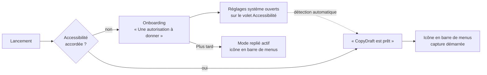
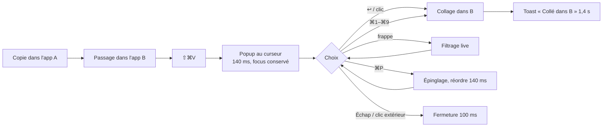

# Conception UX — CopyDraft

Le design system fourni fait foi. Ce document ne redéfinit ni couleurs, ni composants : il
décrit les **parcours**, l'**inventaire des surfaces** et la **correspondance** entre chaque
maquette et le code à écrire.

---

## 1. Principes d'interaction

1. **Le geste avant l'écran.** L'utilisateur appelle CopyDraft pour gagner deux secondes : toute
   surface s'ouvre en moins de 150 ms et se referme dès son but atteint.
2. **La main ne quitte pas le clavier.** Chaque action de la popup a une touche ; la souris est
   un confort, jamais un passage obligé.
3. **L'app active reste active.** Rien ne clignote, rien ne perd son focus visuel, la popup se
   pose au-dessus et repart.
4. **Rien ne se remarque.** Aucune animation au-delà de 180 ms, aucune illustration, aucun ton
   badin, aucune pastille d'alerte.
5. **Un état vide dit ce qui va s'y passer**, jamais « aucune donnée ».

---

## 2. Parcours

### 2.1 Premier lancement

L'écran d'onboarding est la **seule** fenêtre plein format de l'application. Il ne réapparaît
qu'en cas de révocation de la permission.

### 2.2 Le geste (parcours nominal)

### 2.3 Recherche

Ouverture → le champ a le focus dès l'ouverture → chaque frappe filtre sans latence perceptible
→ la sélection retombe sur le premier résultat → les indices `⌘n` disparaissent → `Échap` vide
la recherche, un second `Échap` ferme la popup.

### 2.4 Se protéger

Trois gestes, trois niveaux : automatique (contenus confidentiels toujours ignorés), durable
(exclusion d'une application depuis son menu contextuel ou les réglages), ponctuel (pause depuis
le pied de popup ou le menu de la barre de menus, signalée par un bandeau ambre et l'icône
atténuée).

---

## 3. Inventaire des surfaces

| # | Surface | Référence design system | Dimensions | Composant |
|---|---|---|---|---|
| 1 | Popup flottante | §3 | 360 × 148–564 (≤ 60 % écran) | `PopupPanel` + `PopupView` |
| 2 | Cellule d'historique | §2.5 | 348 × 44 ou 60 | `HistoryCell` |
| 3 | Champ de recherche | §2.3 | h 28, r 6 | `CDSearchField` |
| 4 | Pied de popup | §3, §5 | h 32 | `FooterBar` |
| 5 | Bandeau de pause | §5 | pleine largeur | `PauseBanner` |
| 6 | État vide | §5 | — | `EmptyStateView` |
| 7 | Aucun résultat | §5 | — | `NoResultsView` |
| 8 | Squelette de restauration | §5 | — | `RestoringView` |
| 9 | Menu de barre de menus | §6 | 252, items 22 | `QuickMenuBuilder` |
| 10 | Icône de barre de menus | §6 | 18 × 18 template, 2 états | `StatusItemController` |
| 11 | Réglages — 5 onglets | §7 | 480 × variable | `SettingsWindowController` |
| 12 | Enregistreur de raccourci | §7 | min 96 × 24 | `CDShortcutRecorder` |
| 13 | Onboarding — 2 états | §8 | 560 × 420 | `OnboardingWindowController` |
| 14 | Menu contextuel d'élément | §9 | — | `ItemContextMenu` |
| 15 | Éditeur d'élément (P2) | §9 | — | `ItemEditor` |
| 16 | Alerte « Tout effacer » | §9 | alerte système | `ClearAllAlert` |
| 17 | Toast | §9 | centré, bas + 24 | `ToastPresenter` |
| 18 | À propos | §9 | — | `AboutPanel` |

---

## 4. Anatomie de la cellule (composant central)

| Zone | Contenu | Spécification |
|---|---|---|
| 1 | Vignette | 28 × 28, r 6 — icône de l'app source, glyphe de type si l'app est inconnue, miniature pour une image |
| 2 | Aperçu | 1 à 2 lignes, 13/17 (mono 11,5/17 pour le code) ; ellipsis en fin, **au milieu** pour URLs et chemins |
| 3 | Métadonnées | 11/14 en `--text-2` — app · horodatage relatif · volume, séparés par « · » |
| 4 | Épingle | 14 pt accent si épinglé ; épingle fantôme `--text-3` au survol, cliquable sans coller |
| 5 | Indice `⌘n` | min 24 × 16, r 4 — rangs 1 à 9 puis `⌘0`, masqué pendant une recherche |

États : repos (transparent) · survol (`--fill-2` + épingle fantôme, 60 ms) · sélectionné
(accent plein, texte blanc, 80 ms) · pressé (accent assombri + `scale(0.985)`, 60 ms). Survol et
sélection ne se cumulent jamais : la sélection l'emporte.

---

## 5. Table des raccourcis (popup ouverte)

| Touche | Action |
|---|---|
| `↑` `↓` | Déplace la sélection, sans rebouclage |
| `⌥↑` `⌥↓` | Début / fin de liste |
| `↩︎` | Colle dans l'app active et ferme |
| `⇧↩︎` | Colle sans mise en forme |
| `⌘1`–`⌘9`, `⌘0` | Colle directement le *n*-ième élément |
| `⌘P` | Épingle / désépingle |
| `⌘C` | Copie sans coller |
| `⌫` | Supprime la sélection (recherche vide) |
| `⇥` | Recherche → liste → pied → recherche |
| `A`–`Z`, chiffres | Alimente la recherche sans quitter la liste |
| `Échap` | Vide la recherche, puis ferme |

---

## 6. Correspondance design system → code

| Élément du design system | Transcription |
|---|---|
| §1.1 Couleurs sémantiques | `CD.Color`, adossé à `NSColor` système quand un équivalent existe |
| §1.2 Typographie | `CD.Font` — 8 rôles, jamais de taille littérale dans une vue |
| §1.3 Espacements | `CD.Space` — base 4 pt, demi-pas 2 et 6 réservés à la popup |
| §1.4 Rayons, ombres | `CD.Radius`, `CD.Elevation` — trois niveaux, ombre large réservée à la popup |
| §1.5 Iconographie | SF Symbols nommés, poids `.regular`, échelle `.small`, `--text-2` |
| §1.6 Tokens | `Tokens.swift` = transcription littérale ; `tokens.json` conservé comme source |
| §2 Composants | `Components/` — un fichier par composant, tous les états dessinés |
| §10 Mouvement | `CD.Motion` — durées du tableau, courbe unique, respect de « Réduire les animations » |
| §10 Accessibilité | Contrastes vérifiés, cibles ≥ 22 pt, libellés VoiceOver, ordre de tabulation clos |

**Règle de travail** : tout écart ou manque par rapport au design system est signalé et validé
avant implémentation ; aucun composant n'est inventé.

---

## 7. Micro-décisions à confirmer au test d'usage

1. `⇧⌘V` par défaut, alors que plusieurs applications l'utilisent pour « coller en adaptant le
   style » — le raccourci est personnalisable, mais le défaut mérite un essai réel.
2. L'infobulle d'aperçu étendu à 800 ms peut gêner la navigation à la souris : à valider, sinon
   la porter à 1 200 ms.
3. La suppression par `⌫` est sans confirmation : cohérente avec la rapidité recherchée, à
   assortir éventuellement d'un `⌘Z` (hors périmètre v1 si non nécessaire).
